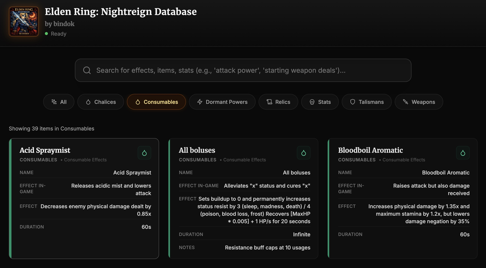

# Elden Ring: Nightreign Database

A comprehensive, searchable database for Elden Ring: Nightreign items, stats, effects, and more.



## Features

- **Automatic Excel Loading**: Loads the Nightreign data file automatically on startup
- **Flexible Search**: Search across all sheets and columns with real-time results
- **Dynamic Cards**: Results display all columns from matched rows, adapting to different data structures
- **Category Filtering**: Filter by Talismans, Weapons, Relics, Dormant Powers, Stats, and more
- **Dark Theme**: Beautiful dark UI with amber accents
- **Docker Support**: Easy deployment with Docker and docker-compose

## Quick Start

### Local Development

1. Install dependencies:
   ```bash
   npm install
   ```

2. Start the development server:
   ```bash
   npm run dev
   ```

3. Open [http://localhost:3383](http://localhost:3383) in your browser

### Docker Deployment

1. Build and run with docker-compose:
   ```bash
   docker-compose up --build
   ```

2. Access at [http://localhost:3383](http://localhost:3383)

Or build manually:
```bash
docker build -t nightreign-dashboard .
docker run -p 3383:80 nightreign-dashboard
```

## Project Structure

```
nightreign-dashboard/
├── public/
│   └── nightreign-data.xlsx    # Excel data file
├── src/
│   ├── components/               # React components
│   │   ├── DataCard.jsx
│   │   ├── SearchBar.jsx
│   │   ├── CategoryFilter.jsx
│   │   ├── Header.jsx
│   │   └── FileUploader.jsx
│   ├── hooks/
│   │   └── useExcelData.js       # Excel loading hook
│   ├── utils/
│   │   ├── excelParser.js        # Excel parsing logic
│   │   └── searchEngine.js       # Search functionality
│   ├── styles/
│   │   └── index.css             # Global styles
│   ├── App.jsx                   # Main app component
│   └── main.jsx                  # Entry point
├── Dockerfile
├── docker-compose.yml
└── package.json
```

## Usage

### Search Examples

- **"attack power frost"** - Find all items/effects related to frost attack power
- **"starting weapon deals"** - Find relic effects for starting weapons
- **"talisman"** - Find all talisman-related entries
- **Partial matches** - Any substring will match

### Features

- Search is **case-insensitive**
- Results show **all columns** from the matched row
- **Highlighted** search terms in results
- **Category filtering** to narrow down results
- **Manual file upload** to replace data on the fly

## Technology Stack

- **React 18** - UI framework
- **Vite** - Build tool and dev server
- **Tailwind CSS** - Styling
- **SheetJS (xlsx)** - Excel file parsing
- **Lucide React** - Icons
- **Docker** - Containerization
- **Nginx** - Production web server

## Scripts

- `npm run dev` - Start development server
- `npm run build` - Build for production
- `npm run preview` - Preview production build
- `npm run docker:build` - Build Docker image
- `npm run docker:up` - Start with docker-compose
- `npm run docker:down` - Stop docker-compose

## Data Structure

The Excel file contains multiple sheets with varying columns:

- **Relic Effects**: Category, Relic Description, Effect, Stackable with self?, Notes
- **Talisman Effects**: Name, Effect In-Game, Effect, Notes
- **Weapon Effects**: Category, Effect Description In-Game, Effect, Stackable with self?, Notes
- **Dormant Powers**: Category, Dormant Power, Effect Description In-Game, Effect, Notes
- **Consumable Effects**: Name, Effect In-Game, Effect, Duration, Notes
- **Stats**: Character and boss statistics
- And more...

Each card dynamically displays **all available columns** from the matched row.

## License

See LICENSE file for details.

## Credits

Data compiled from Elden Ring: Nightreign game information and from the Nightreign Relic Stat Spreadsheet I found here -


---